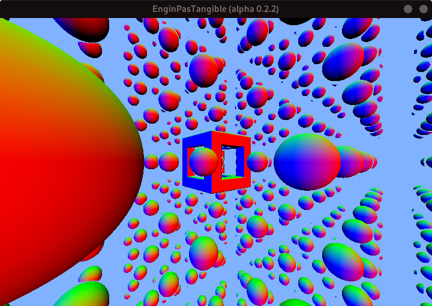
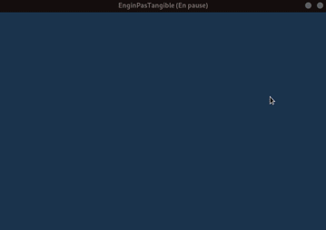
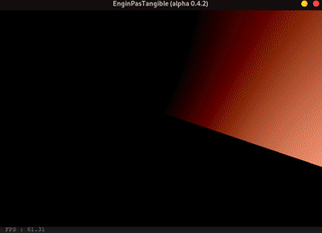
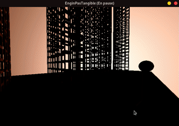

# EnginPasTangible

Moteur graphique qu'est pas croyable tellement qu'il est bien ! 
> développé par *Victor LASSERRE* et *Valentin SERVIERES*

---
⚠️ Le projet est en cours de création, il peut y avoir des bugs. ⚠️

---

## Installation

Pour pouvoir utiliser le moteur il vous suffit d'installer les librairies glfw.
> ### Linux

* Pour les distributions Debian :
  
  `sudo apt install libglfw3-dev`
* Pour Arch Linux :
  
  Si vous utilisez X11 (recommandé) : `sudo pacman -Sy glfw-x11` 
  Si vous utilisez Wayland : `sudo pacman -Sy glfw-wayland`

 
Puis, Dans le repertoire de votre choix

`git clone https://git.etud.insa-toulouse.fr/serviere/EnginPasTangible.git` 
`cd EnginPasTangible/` 
`chmod +x run_linux.sh`

Pour compiler et exécuter le programme utilisez `./run_linux main.c`
  
Utilisez `git pull origin master` pour mettre à jour votre version du moteur graphique
  

> ### Windows & MacOs

 
Essayez d'adapter les méthodes montrées ci-dessus, aucune garantie que cela fonctionne (bonne chance). 
 

---
## Images issues d'EnginPasTangible

### V0.2.2

 
Capture d'écran de la toute première version d'EnginPasTangible (v0.2.2)

### V0.2.5

 
Rotation autour du centre contrôlée par la souris (v0.2.5)

### V0.4.2

 
Cycle jour nuit dans une scene avec des tours et déplacements clavier souris (v0.4.2)

### V0.5.1

 
Ajout des couleurs d'objets avec réflexions (v0.5.1)