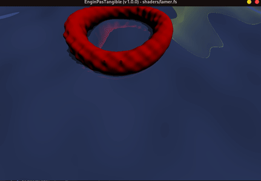
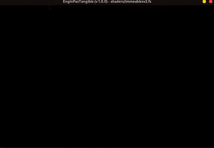

# EnginPasTangible

Moteur graphique qu'est pas croyable tellement qu'il est bien ! 
> développé par *Victor LASSERRE* et *Valentin SERVIERES*

---
⚠️ Le projet est toujours en cours de développement, il peut y avoir des bugs. ⚠️

---
## Images issues d'EnginPasTangible

 
Evolution du moteur graphique (première version à la v1.0.0)

 
Petite animation d'océan

 
Cycle jour/nuit dans une ville

---
## Contrôles
Les déplacements se font en vue aérienne. 

### Déplacements
Avancer/Reculer : <kbd>&uarr;</kbd>/<kbd>&darr;</kbd> ou <kbd>Z</kbd>/<kbd>S</kbd> 
Gauche/Droite : <kbd>&larr;</kbd>/<kbd>&rarr;</kbd> ou <kbd>Q</kbd>/<kbd>D</kbd> 
Monter/Descendre : <kbd>Space</kbd>/<kbd>Left Ctrl</kbd> 

Sprint : <kbd>Left Shift</kbd> 
 

### Contrôles caméra
La souris permet de choisir la direction 
Zoomer dézoomer : <kbd>Scroll</kbd> 
Activer/Désactiver la vue orthogonale : <kbd>Tab</kbd> 
 
### Divers
Play/Pause : <kbd>Escape</kbd> 
Fermer la fenêtre : <kbd>Backspace</kbd> 
 

### Special
Ces commandes peuvent être utilisées dans certaines scènes uniquement
Activer/Désactiver : <kbd>C</kbd> (dans artefacts.fs) 
Incrémenter/Décrémenter : <kbd>B</kbd>/<kbd>N</kbd> (dans evol.fs) 
<b>Uniquement dans demo et le programme principal</b> : scène précédente/suivante : <kbd>F</kbd>/<kbd>J</kbd>

---

## Installation

Pour pouvoir utiliser le moteur il vous suffit d'installer les librairies glfw.
> ### Linux

* Pour les distributions Debian :
  
  `sudo apt install libglfw3-dev`
* Pour Arch Linux :
  
  Si vous utilisez X11 (recommandé) : `sudo pacman -Sy glfw-x11` 
  Si vous utilisez Wayland : `sudo pacman -Sy glfw-wayland`

 
Puis, dans le repertoire de votre choix

`git clone https://github.com/MagicTINTIN/EnginPasTangible.git` 
`cd EnginPasTangible/` 
`chmod +x run_linux.sh`

Pour compiler EnginPasTangible, executez `./compileEPT.sh EnginPasTangible.c`

Une fois votre programme compilé, vous pouvez exécuter `./ept chemin/vers/un/fichier.fs` 
*(plusieurs fichiers sont disponibles dans shaders/)* 
Vous pouvez importer plusieurs fichiers .fs (max 100), pour changer de scène il vous suffit d'appuyer sur les touches <kbd>F</kbd> ou <kbd>J</kbd>

*Pour compiler et exécuter le programme en version debug utilisez `./run_linux main.c`*
  
Utilisez `git pull origin master` pour mettre à jour votre version du moteur graphique
  

> ### Windows & MacOs

 
Essayez d'adapter les méthodes montrées ci-dessus, aucune garantie que cela fonctionne (bonne chance).